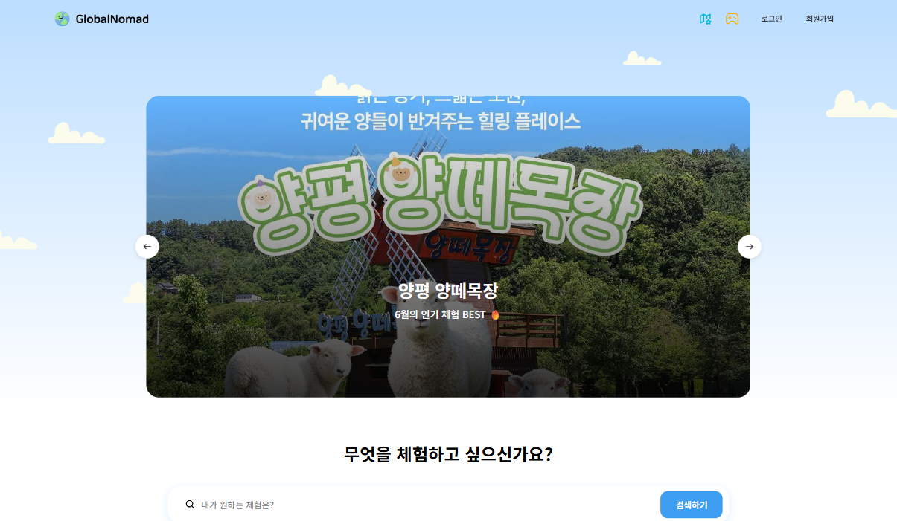

# 🌏 Nomadly

> **Based on:** [GlobalNomad](https://github.com/Hanbh97/GlobalNomad)
>
> 팀 단위 개발이 종료되어, GlobalNomad를 리브랜딩하고 리팩토링 및 유지보수를 위해 개인 Vercel 프로젝트로 배포했습니다.

Nomadly는 여행·레저 체험(액티비티)을 한곳에서 예약하고 관리하는 플랫폼입니다. 사용자는 다양한 체험을 둘러보고 날짜·시간대를 골라 예약할 수 있고, 호스트는 자신의 체험을 등록해 예약 현황을 관리할 수 있습니다. 카카오 소셜 로그인, 찜, 후기, 지도 위치 정보, 알림까지 예약에 필요한 흐름을 한 번에 제공합니다.

<hr>

## 📸 미리보기

| 메인                                           |
| ---------------------------------------------- |
|  |

<hr>

## 🛠️ 기술 스택

| 구분        | 기술                              |
| ----------- | --------------------------------- |
| Framework   | Next.js 16 (App Router), React 19 |
| Language    | TypeScript                        |
| Styling     | Tailwind CSS                      |
| 데이터 패칭 | TanStack React Query, Axios       |
| 폼 관리     | React Hook Form                   |
| 인증        | Kakao OAuth                       |
| 지도        | Kakao Maps                        |
| 알림        | React Hot Toast                   |
| 슬라이더    | Swiper                            |
| 코드 품질   | ESLint, Prettier                  |

<hr>

## 🚀 시작하기

```bash
# 의존성 설치
npm install

# 개발 서버 실행
npm run dev
```

[http://localhost:3000](http://localhost:3000) 에서 확인할 수 있습니다.

### 환경 변수

루트에 `.env.local` 파일을 만들고 아래 값을 설정하세요.

```bash
NEXT_PUBLIC_API_BASE_URL=        # API 서버 주소
NEXT_PUBLIC_KAKAO_REST_API_KEY=  # 카카오 REST API 키
NEXT_PUBLIC_KAKAO_REDIRECT_URI=  # 카카오 로그인 리다이렉트 URI
```

### 스크립트

```bash
npm run dev     # 개발 서버
npm run build   # 프로덕션 빌드
npm run start   # 프로덕션 서버
npm run lint    # 린트 검사
```

<hr>

## ✨ 주요 기능

- **인증** — 회원가입 / 로그인, 카카오 OAuth 소셜 로그인
- **체험 둘러보기** — 체험 목록 조회, 상세 페이지, 후기 확인
- **예약** — 날짜·시간대별 예약 신청 및 예약 가능 일정 조회
- **마이페이지** — 내 정보 관리, 내 예약 내역, 찜(북마크) 목록
- **호스트 기능** — 체험 등록·수정, 내 체험 관리, 예약 현황 관리
- **알림** — 예약 상태에 따른 실시간 알림 확인
- **추천 / 게임** — MBTI·밸런스·경험 기반 추천, 룰렛, 미니게임(닷지, 지구 점프, 틱택토)
- **정책 페이지** — FAQ, 개인정보처리방침

<hr>

## 📁 프로젝트 구조

```
src/
├── app/                  # Next.js App Router (라우트 그룹 기반)
│   ├── (auth)/           # 로그인 · 회원가입
│   ├── (main)/           # 메인 · 체험 목록/상세 · 정책
│   ├── (mypage)/         # 마이페이지 · 호스트 체험 관리
│   ├── api/proxy/        # API 프록시 라우트
│   ├── oauth/kakao/      # 카카오 OAuth 콜백
│   ├── recommendation/   # 추천 기능
│   └── game/             # 미니게임
├── features/             # 도메인별 기능 모듈 (api · components · hooks · queries)
├── components/           # 공용 UI 컴포넌트 (Button, Modal, Input, layout 등)
├── hooks/                # 전역 커스텀 훅
├── lib/                  # api · http · query · utils
├── constants/            # 상수 (icons, images, policy 등)
├── types/                # 전역 타입 정의
└── proxy.ts              # 토큰 자동 재발급 프록시 로직
```

기능을 `features/` 도메인 단위로 모듈화하고, 각 모듈 안에서 API·컴포넌트·훅·쿼리를 분리하는 **Feature-based 구조**를 따릅니다.

<hr>

## 👥 팀원 소개

| 팀원                                                                                                                  | 담당                                                                                                                    |
| --------------------------------------------------------------------------------------------------------------------- | ----------------------------------------------------------------------------------------------------------------------- |
| [](https://github.com/Hanbh97)<br/>**한병현(팀장)**             | • 체험 상세 페이지<br/>• 공통컴포넌트 Image Input, Dropdown, Reservation Modal<br/>• 협업 문서 정리                     |
| [](https://github.com/JuHeonParkk)<br/>**박주헌**           | • 내 체험 관리 페이지, 체험 등록/수정 페이지<br/>• 공통컴포넌트 Layout, Sidemenu, Toast<br/>• 무한 스크롤, 폼 이탈 방지 |
| [](https://github.com/Eugenekmp)<br/>**박경민**               | • 예약 내역 페이지<br/>• 공통컴포넌트 Modal, Footer<br/>• auth / oauth(카카오), clientFetch / serverFetch               |
| [](https://github.com/hhhnseo)<br/>**장현서**                   | • 예약 현황 페이지, 체험 추천 페이지, 게임 페이지<br/>• 공통컴포넌트 State Badge, Pagination<br/>• 알림                 |
| [](https://github.com/ejlee6742-source)<br/>**이은지** | • 메인 페이지, 관심 체험 페이지<br/>• 공통컴포넌트 Style System, Input<br/>• 북마크, favicon, OG 이미지                 |
| [](https://github.com/imyoonsoo)<br/>**서윤수**               | • 로그인/회원가입 페이지, 내 정보 페이지<br/>• 공통컴포넌트 Button, Filter Button                                       |

<hr>

## 📅 프로젝트 기간 & 관련 링크

- **진행 기간**: 2026년 5월 26일 ~ 2026년 6월 24일
- **Figma 디자인 시안**: [Figma Link](https://www.figma.com/design/q8w2SRonoWBGKGJr6cmN7M/GlobalNomad---Design?node-id=29265-11572&p=f&t=0ibruTnaQNr0lWmH-0)
- **API Swagger 문서**: [Swagger API Docs](https://sp-globalnomad-api.vercel.app/docs/#/)
- **Vercel 배포 주소**: [Vercel 배포 링크](https://nomadly-imyoonsoo.vercel.app/)
