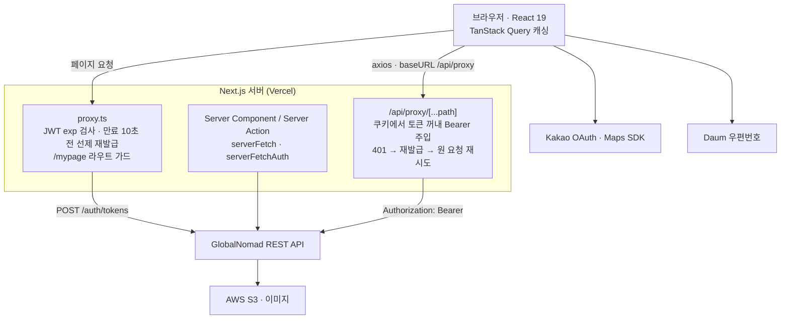

# 🗺 Nomadly

> **Forked from:** [GlobalNomad](https://github.com/Hanbh97/GlobalNomad)
>
> 팀 프로젝트 'GlobalNomad' 종료 후, 기술적 성장을 이어가고자 이를 포크했습니다.<br>
> 기존의 정체성은 유지하면서 고유한 명칭 '**Nomadly**'로 재배포했으며,<br>
> 현재 리팩토링 및 성능 최적화, 기능 확장을 진행하며 지속적으로 개선해 나가고 있습니다.

<br>
Nomadly는 일상 밖의 특별한 체험을 탐색하고 예약할 수 있는 플랫폼입니다.<br>
체험을 이용하는 게스트와 운영하는 호스트 모두를 지원합니다.
<br><br>

## 📍 목차

- [개요](#overview)
- [Fork 이후 개선 작업](#improvements)
- [주요 기능](#features)
- [기술 스택](#stack)
- [시스템 아키텍처](#architecture)
- [프로젝트 구조](#structure)
- [시작하기](#getting-started)
- [컨벤션](#convention)
- [팀원 및 역할](#team)

---

<div id="overview"></div>

## 📋 개요

| 구분                    | 개발기간             | 내용                                                                                                                                                         |
| ----------------------- | -------------------- | ------------------------------------------------------------------------------------------------------------------------------------------------------------ |
| **원본 팀 프로젝트**    | 2026.05.26 ~ 06.24   | 6인 팀 · 담당: 회원가입 페이지 · 내 정보 페이지 · 공통 컴포넌트(Button · Filter Button · AuthLayout) · [GlobalNomad](https://github.com/Hanbh97/GlobalNomad) |
| **Fork 이후 개인 작업** | 2026.06.24 ~ 진행 중 | 아래 [Fork 이후 개선 작업](#improvements) 참조                                                                                                               |

- [**Vercel 배포**](https://nomadly-imyoonsoo.vercel.app)

<br>

<div id="improvements"></div>

## 📈 Fork 이후 개선 작업

팀 프로젝트를 포크한 뒤 진행한 주요 개선 작업입니다.

### 레이아웃 시프트 제거

배포본 기준 CLS가 모바일 0.451 · 데스크탑 0.413에서 **모두 0**으로 떨어졌습니다.

로딩이 끝나고 배너와 카드가 들어오는 순간 아래 내용이 밀려 내려갔습니다. 스켈레톤을 실제 화면과 같은 크기로 만들어 자리를 먼저 잡았습니다. 틀 크기가 그대로라 안쪽 내용만 채워집니다.

| 요소             | 스켈레톤                               | 실제 화면 |
| ---------------- | -------------------------------------- | --------- |
| 메인 배너        | `aspect-[1/0.6]` · `md:aspect-[1/0.5]` | 같음      |
| 체험 카드 이미지 | `aspect-[1/1.1]`                       | 같음      |

카드는 이미지 자리뿐 아니라 그 위로 겹쳐 올라오는 텍스트 영역(`-mt-12.5`)까지 같이 잡아둬서 전체 높이가 같습니다.

### 이미지 로딩 최적화

화면이 작든 크든 이미지가 원본 크기 그대로 내려오고 있었습니다. `next/image`의 `sizes`를 화면에서 실제로 차지하는 폭에 맞춰 지정하고, 가장 먼저 보이는 배너에는 `priority`를 붙여 먼저 불러오게 했습니다.

| 위치      | `sizes`                                                    |
| --------- | ---------------------------------------------------------- |
| 메인 배너 | `(max-width: 1200px) 100vw, 1200px`                        |
| 체험 카드 | `(max-width: 768px) 50vw, (max-width: 1200px) 25vw, 300px` |
| 상세 배너 | `50vw`                                                     |

### 웹 접근성 개선

로딩 중이라는 걸 눈으로만 알 수 있었습니다. 스켈레톤 세 곳에 `role="status"`와 `aria-live="polite"`를 넣어 스크린 리더가 읽도록 하고, `sr-only` 텍스트로 무엇을 기다리는 중인지 알려줍니다.

아이콘만 있어 이름이 없던 버튼 30곳에 `aria-label`을 붙이고, 페이지마다 `<main>`을 정리했습니다.

### 체험 설명 줄바꿈 처리

판매자가 체험 상품 설명을 문단으로 나눠 작성해도, 실제 화면에서는 전부 한 덩어리로 붙어 나왔습니다. `whitespace-pre-wrap`으로 입력한 줄바꿈을 살리고, `break-keep`으로 한글 단어가 어절 중간에서 잘리지 않게 했습니다.

|                                  적용 전                                   |                                  적용 후                                  |
| :------------------------------------------------------------------------: | :-----------------------------------------------------------------------: |
|  |  |

### 그 외

- **번들 크기 절감** — 저장소에 남아 있던 22MB 목업 이미지를 제거하고, React Query Devtools를 `dynamic import`로 분리해 프로덕션 번들에서 뺐습니다.
- **폰트 self-host** — Pretendard를 `next/font/local`로 전환했습니다. 외부 요청이 사라지고, 폰트가 교체되는 순간 글자 크기가 달라지며 생기던 밀림도 함께 없어졌습니다.
- **CI 파이프라인 구축** — PR을 열면 lint와 프로덕션 빌드가 자동으로 검증됩니다. 여기에 Claude가 인라인 코멘트로 리뷰하고, 요약을 Notion 데이터베이스에 기록합니다.
- **개발환경 정비** — `git blame` 제외 설정과 `.gitattributes` LF 정규화, Prettier 플러그인 기반 Tailwind 클래스 자동 정렬을 더했습니다.

<br>

<div id="features"></div>

## ✨ 주요 기능

- **인증** — 회원가입 / 로그인, 카카오 OAuth 소셜 로그인
- **체험 둘러보기** — 체험 목록 조회, 상세 페이지, 후기 확인
- **예약** — 날짜·시간대별 예약 신청 및 예약 가능 일정 조회
- **마이페이지** — 내 정보 관리, 내 예약 내역, 찜(북마크) 목록
- **호스트 기능** — 체험 등록·수정, 내 체험 관리, 예약 현황 관리
- **알림** — 예약 상태에 따른 실시간 알림 확인
- **추천 / 게임** — MBTI·밸런스·경험 기반 추천, 룰렛, 미니게임(닷지, 지구 점프, 틱택토)
- **정책 페이지** — FAQ, 개인정보처리방침

<br>

<div id="stack"></div>

## 🔧 기술 스택

| Category           | Tech                    |
| ------------------ | ----------------------- |
| **Framework**      | Next.js 16 (App Router) |
| **Library**        | React 19                |
| **Language**       | TypeScript              |
| **Styling**        | Tailwind CSS v4         |
| **Server State**   | TanStack Query          |
| **HTTP Client**    | Axios                   |
| **Form**           | React Hook Form         |
| **Authentication** | Kakao OAuth             |
| **Maps**           | Kakao Maps              |
| **Notification**   | React Hot Toast         |
| **UI**             | Swiper                  |
| **Code Quality**   | ESLint, Prettier        |

<br>

<div id="architecture"></div>

## 🏗️ 시스템 아키텍처

백엔드 REST API는 외부에서 제공되며, 이 저장소는 프론트엔드를 담당합니다.
다만 브라우저가 API를 직접 호출하지 않고, **Next.js 서버가 인증과 API 중계를 맡는 BFF 계층**을 두었습니다.



<br>

<div id="structure"></div>

## 🗂️ 프로젝트 구조

```
src/
├── app/                  # Next.js App Router (라우트 그룹 기반)
│   ├── (auth)/           # 로그인 · 회원가입
│   ├── (main)/           # 메인 · 체험 목록/상세 · 정책
│   ├── (mypage)/         # 마이페이지 · 호스트 체험 관리
│   ├── api/proxy/        # API 프록시 라우트
│   ├── oauth/kakao/      # 카카오 OAuth 콜백
│   ├── recommendation/   # 추천 기능
│   └── game/             # 미니게임
├── features/             # 도메인별 기능 모듈 (api · components · hooks · queries)
├── components/           # 공용 UI 컴포넌트 (Button, Modal, Input, layout 등)
├── hooks/                # 전역 커스텀 훅
├── lib/                  # api · http · query · utils
├── constants/            # 상수 (icons, images, policy 등)
├── types/                # 전역 타입 정의
└── proxy.ts              # 토큰 자동 재발급 프록시 로직
```

`features/`를 중심으로 API, 컴포넌트, 훅, 쿼리를 도메인 단위로 분리한 **Feature-based 구조**를 적용했습니다.

<br>

<div id="getting-started"></div>

## 🚀 시작하기

```bash
npm install
npm run dev      # 개발 서버
npm run build    # 프로덕션 빌드
```

프로젝트 루트에 `.env.local`을 만들고 아래 값을 채워주세요.

```bash
NEXT_PUBLIC_API_BASE_URL=      # 백엔드 REST API 주소
NEXT_PUBLIC_SITE_URL=          # 배포 주소 (OG 메타데이터 기준)
NEXT_PUBLIC_KAKAO_MAP_KEY=     # 카카오 지도 JavaScript 키
NEXT_PUBLIC_KAKAO_REST_API_KEY=  # 카카오 OAuth REST API 키
NEXT_PUBLIC_KAKAO_REDIRECT_URI=  # 카카오 OAuth 리다이렉트 주소
```

클론 직후 아래 명령도 한 번 실행해주세요.

```bash
git config blame.ignoreRevsFile .git-blame-ignore-revs
```

Tailwind 클래스 자동 정렬처럼 전체 파일을 건드리는 대량 포맷팅 커밋을 `git blame`에서 건너뛰도록 설정합니다. 각 코드의 **실제 작성자·변경 이력**이 포맷팅 커밋에 가려지지 않고 정확히 추적됩니다.

<br>

<div id="convention"></div>

## 🗞 컨벤션

프로젝트 컨벤션은 [`conventions/`](conventions) 폴더의 문서를 참고하세요.

- [git 규칙](conventions/git%20규칙.md)
- [디렉터리 구조](conventions/디렉터리%20구조.md)
- [네이밍 규칙](conventions/네이밍%20규칙.md)
- [코드 스타일](conventions/코드%20스타일.md)

<br>

<div id="team"></div>

## 👥 팀원 및 역할

<table>
<tr>
<td align="center" width="150px">
<a href="https://github.com/Hanbh97">

</a>
<br/>
<b>한병현 (팀장)</b>
<br/>
<sub>체험 상세 페이지<br/>Image Input · Dropdown<br/>협업 문서 정리</sub>
</td>
<td align="center" width="150px">
<a href="https://github.com/JuHeonParkk">

</a>
<br/>
<b>박주헌</b>
<br/>
<sub>내 체험 관리<br/>체험 등록 · 수정<br/>무한 스크롤</sub>
</td>
<td align="center" width="150px">
<a href="https://github.com/Eugenekmp">

</a>
<br/>
<b>박경민</b>
<br/>
<sub>예약 내역 페이지<br/>인증 · 카카오 OAuth<br/>fetch 레이어</sub>
</td>
</tr>
<tr>
<td align="center" width="150px">
<a href="https://github.com/hhhnseo">

</a>
<br/>
<b>장현서</b>
<br/>
<sub>예약 현황 페이지<br/>추천 · 게임<br/>알림</sub>
</td>
<td align="center" width="150px">
<a href="https://github.com/ejlee6742-source">

</a>
<br/>
<b>이은지</b>
<br/>
<sub>메인 페이지<br/>관심 체험 페이지<br/>스타일 시스템</sub>
</td>
<td align="center" width="150px">
<a href="https://github.com/imyoonsoo">

</a>
<br/>
<b>서윤수</b>
<br/>
<sub>회원가입 페이지<br/>내 정보 페이지<br/>Button · Filter Button · AuthLayout</sub>
</td>
</tr>
</table>
