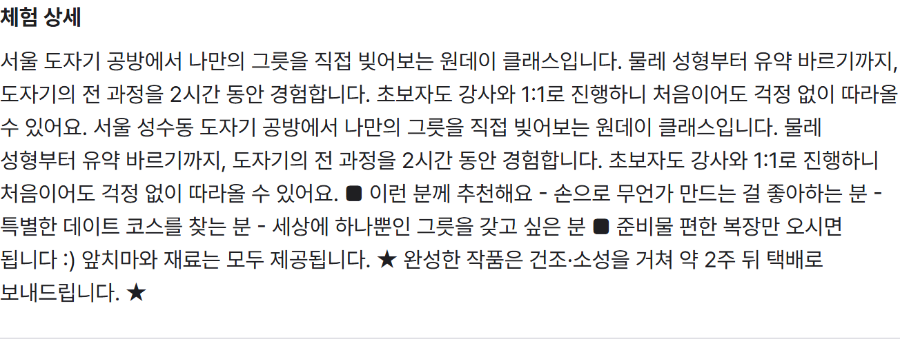
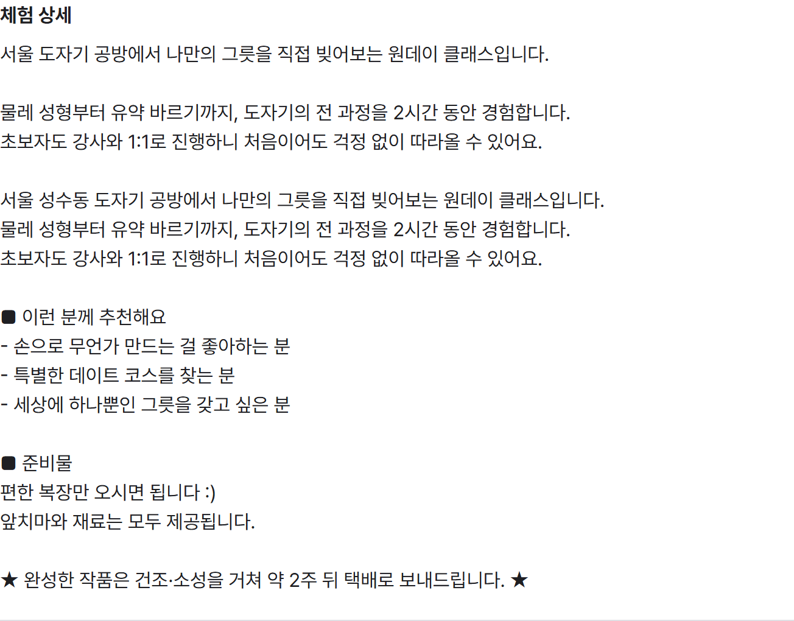

# 🌏 Nomadly

> **Forked from:** [GlobalNomad](https://github.com/Hanbh97/GlobalNomad)
>
> 팀 프로젝트 'GlobalNomad' 종료 후, 기술적 성장을 이어가고자 이를 포크했습니다.<br>
> 기존의 정체성은 유지하면서 고유한 명칭 '**Nomadly**'로 재배포했으며,<br>
> 현재 리팩토링 및 성능 최적화, 기능 확장을 진행하며 지속적으로 개선해 나가고 있습니다.

<br>
Nomadly는 일상 밖의 특별한 체험을 탐색하고 예약할 수 있는 플랫폼입니다.<br>
체험을 이용하는 게스트와 운영하는 호스트 모두를 지원합니다.
<br><br>

## 📍 목차

- [프로젝트 기간 & 배포링크](#info)
- [Fork 이후 개선 작업](#improvements)
- [주요 기능](#features)
- [기술 스택](#stack)
- [프로젝트 구조](#structure)
- [개발환경 세팅](#setup)
- [컨벤션](#convention)

---

<div id="info"></div>

## 📅 프로젝트 기간 & 배포링크

- **원본 팀 프로젝트**: 2026년 5월 26일 ~ 2026년 6월 24일
- **Fork 이후 개인 개선**: 2026년 6월 24일 ~ 진행 중
- [**Vercel 배포**](https://nomadly-imyoonsoo.vercel.app)

<br>

<div id="improvements"></div>

## ⚡ Fork 이후 개선 작업

팀 프로젝트를 포크한 뒤 진행한 주요 개선 작업입니다.

### 체험 설명 줄바꿈 처리

호스트가 체험 설명에 입력한 줄바꿈이 화면에서는 모두 무시돼 한 문단으로 붙어 보였습니다. 설명 영역에 `whitespace-pre-wrap`을 적용해 입력한 줄바꿈이 그대로 나오도록 하고, `break-keep`으로 한글 단어가 어절 중간에서 끊기지 않도록 했습니다.

| 적용 전 | 적용 후 |
| :---: | :---: |
|  |  |

### 레이아웃 시프트 제거 (CLS 0.45 → 0)

로딩이 끝난 뒤 배너·카드가 뒤늦게 삽입되며 화면이 아래로 밀렸습니다. 로딩 중에도 최종 레이아웃과 동일한 공간을 미리 차지하는 스켈레톤 UI를 적용해, 콘텐츠가 채워질 때 자리가 밀리지 않도록 했습니다. 배포본 기준 CLS가 모바일 0.451·데스크탑 0.413에서 모두 0으로 떨어졌습니다.

### 이미지 로딩 최적화

목록·배너 이미지가 화면 크기와 무관하게 큰 해상도로 내려오고 있었습니다. `next/image`의 `sizes`로 뷰포트 폭에 맞는 해상도만 받도록 하고, 가장 먼저 보이는 배너 이미지에는 `priority`를 지정해 LCP 대상 이미지를 우선 로드하도록 했습니다.

### 번들 크기 절감

저장소에 22MB에 달하는 목업 이미지가 포함돼 있어 이를 제거하고, 개발용으로만 쓰이는 React Query Devtools를 `dynamic import`로 분리해 프로덕션 번들에서 빠지도록 했습니다.

### 폰트 self-host

Pretendard를 외부에서 불러오던 것을 `next/font/local`로 self-host했습니다. 외부 요청이 사라지고, 폰트가 교체되는 순간 글자 크기가 달라지며 발생하던 레이아웃 밀림도 함께 제거됐습니다.

### 웹 접근성 개선

로딩 스켈레톤에 `role="status"`·`aria-live`를 부여해 스크린 리더가 로딩 상태를 읽도록 하고, 아이콘만 있는 버튼에는 `aria-label`을, 페이지에는 `<main>` 랜드마크를 정리해 넣었습니다.

### GitHub Actions 워크플로우 구축

PR을 열면 코드 리뷰와 검사가 자동으로 실행되도록 GitHub Actions를 구성하고, Prettier 플러그인으로 Tailwind 클래스 순서를 자동 정렬했습니다. 여기에 `git blame` 제외 설정과 `.gitattributes` 기반 LF 정규화를 더해 협업 환경을 정비했습니다.

> 관련 PR: [#23 성능·a11y](https://github.com/imyoonsoo/nomadly/pull/23) · [#26 코드리뷰봇](https://github.com/imyoonsoo/nomadly/pull/26) · [#29 개행 통일](https://github.com/imyoonsoo/nomadly/pull/29)

<br>

<div id="features"></div>

## 🔌 주요 기능

- **인증** — 회원가입 / 로그인, 카카오 OAuth 소셜 로그인
- **체험 둘러보기** — 체험 목록 조회, 상세 페이지, 후기 확인
- **예약** — 날짜·시간대별 예약 신청 및 예약 가능 일정 조회
- **마이페이지** — 내 정보 관리, 내 예약 내역, 찜(북마크) 목록
- **호스트 기능** — 체험 등록·수정, 내 체험 관리, 예약 현황 관리
- **알림** — 예약 상태에 따른 실시간 알림 확인
- **추천 / 게임** — MBTI·밸런스·경험 기반 추천, 룰렛, 미니게임(닷지, 지구 점프, 틱택토)
- **정책 페이지** — FAQ, 개인정보처리방침

<br>

<div id="stack"></div>

## 🔧 기술 스택

| Category           | Tech                    |
| ------------------ | ----------------------- |
| **Framework**      | Next.js 16 (App Router) |
| **Library**        | React 19                |
| **Language**       | TypeScript              |
| **Styling**        | Tailwind CSS            |
| **Server State**   | TanStack Query          |
| **HTTP Client**    | Axios                   |
| **Form**           | React Hook Form         |
| **Authentication** | Kakao OAuth             |
| **Maps**           | Kakao Maps              |
| **Notification**   | React Hot Toast         |
| **UI**             | Swiper                  |
| **Code Quality**   | ESLint, Prettier        |

<br>

<div id="structure"></div>

## 🗂️ 프로젝트 구조

```
src/
├── app/                  # Next.js App Router (라우트 그룹 기반)
│   ├── (auth)/           # 로그인 · 회원가입
│   ├── (main)/           # 메인 · 체험 목록/상세 · 정책
│   ├── (mypage)/         # 마이페이지 · 호스트 체험 관리
│   ├── api/proxy/        # API 프록시 라우트
│   ├── oauth/kakao/      # 카카오 OAuth 콜백
│   ├── recommendation/   # 추천 기능
│   └── game/             # 미니게임
├── features/             # 도메인별 기능 모듈 (api · components · hooks · queries)
├── components/           # 공용 UI 컴포넌트 (Button, Modal, Input, layout 등)
├── hooks/                # 전역 커스텀 훅
├── lib/                  # api · http · query · utils
├── constants/            # 상수 (icons, images, policy 등)
├── types/                # 전역 타입 정의
└── proxy.ts              # 토큰 자동 재발급 프록시 로직
```

`features/`를 중심으로 API, 컴포넌트, 훅, 쿼리를 도메인 단위로 분리한 **Feature-based 구조**를 적용했습니다.

<br>

<div id="setup"></div>

## ⚙️ 개발환경 세팅

클론 후 아래 명령을 한 번 실행하세요.

```bash
git config blame.ignoreRevsFile .git-blame-ignore-revs
```

Tailwind 클래스 자동 정렬처럼 전체 파일을 건드리는 대량 포맷팅 커밋을 `git blame`에서 건너뛰도록 설정합니다. 각 코드의 **실제 작성자·변경 이력**이 포맷팅 커밋에 가려지지 않고 정확히 추적됩니다.

<br>

<div id="convention"></div>

## 📍 컨벤션

프로젝트 컨벤션은 [`conventions/`](conventions) 폴더의 문서를 참고하세요.

- [git 규칙](conventions/git%20규칙.md)
- [디렉터리 구조](conventions/디렉터리%20구조.md)
- [네이밍 규칙](conventions/네이밍%20규칙.md)
- [코드 스타일](conventions/코드%20스타일.md)
